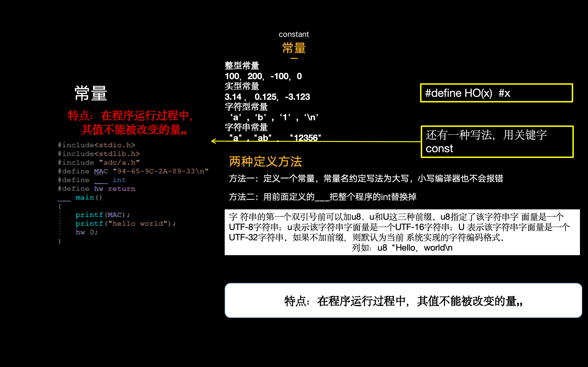
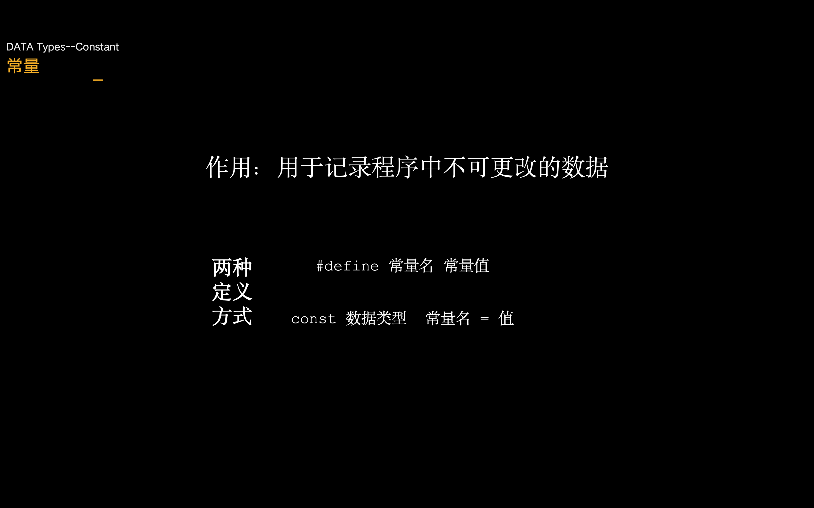

# const 定义常量在c语言编程中什么场景用到

在 C 语言编程中，`const` 关键字用于定义常量，它的主要作用是指示编译器该变量的值在初始化后不会被改变。使用 `const` 定义常量有以下几种常见场景：

### 1. 保护数据不被修改

当您希望确保某个变量的值在程序运行期间不会被修改时，可以使用 `const`。这对于保护重要数据或配置值非常有用。

```c
const int MAX_USERS = 100;

void addUser() {
    // MAX_USERS = 200; // 错误：不能修改常量
}

```

### 2. 提高代码可读性

使用 `const` 可以使代码更具可读性，表明某些值是固定的，不会改变。这样可以帮助其他开发者更好地理解代码的意图。

```c
const double PI = 3.14159;

double calculateCircumference(double radius) {
    return 2 * PI * radius;
}

```

### 3. 用于函数参数

在函数参数中使用 `const` 可以防止函数修改传入的参数，特别是在传递指针或数组时。这有助于确保函数的副作用最小化。

```c
void printArray(const int *arr, int size) {
    for (int i = 0; i < size; i++) {
        printf("%d ", arr[i]); // 可以读取，但不能修改 arr[i]
    }
}

```

### 4. 常量表达式

在某些情况下，您可能希望使用常量表达式进行数组大小或其他需要编译时常量的地方。使用 `const` 可以让编译器在编译时计算这些值。

```c
const int SIZE = 10;
int array[SIZE];  // SIZE 是常量，可以用于定义数组大小

```

### 5. 提高性能

在某些情况下，使用 `const` 可能会使编译器进行更多的优化，因为编译器知道这些值不会改变。这样可以提高程序的性能。

### 6. 作为宏的替代

在一些情况下，使用 `const` 可以替代宏定义，提供更好的类型安全和作用域控制。

```c
#define MAX_VALUE 255  // 宏定义

// 使用 const
const int MAX_VALUE = 255;  // 常量

```

### 7. 防止函数返回的指针被修改

在 C 语言中，使用 `const` 修饰函数的返回值可以防止返回的值被修改。虽然直接返回基本数据类型（如 `int`、`float` 等）时，返回值本身无法被修改，但当返回一个指针（如指向数组或结构体的指针）时，使用 `const` 可以有效地保护返回的数据。

```c
#include <stdio.h>

typedef struct {
    int id;
    const char *name; // 使用 const 修饰，防止修改
} User;

const User* getUser() {
    static User user = {1, "Alice"};
    return &user; // 返回指向 User 的指针
}

int main() {
    const User *userPtr = getUser();
  
    printf("User ID: %d\n", userPtr->id);
    printf("User Name: %s\n", userPtr->name);
  
    // 尝试修改返回的指针指向的内容，将会导致编译错误
    // userPtr->name = "Bob"; // 错误：无法修改 const 数据

    return 0;
}

```

### 总结

`const` 关键字在 C 语言中具有多种用途，包括保护数据、提高代码可读性、用于函数参数、常量表达式、提高性能和作为宏的替代。合理使用 `const` 可以使代码更安全、清晰和易于维护。
